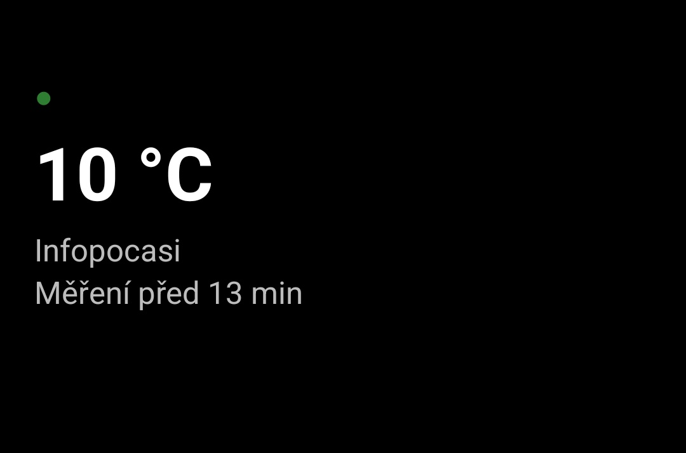
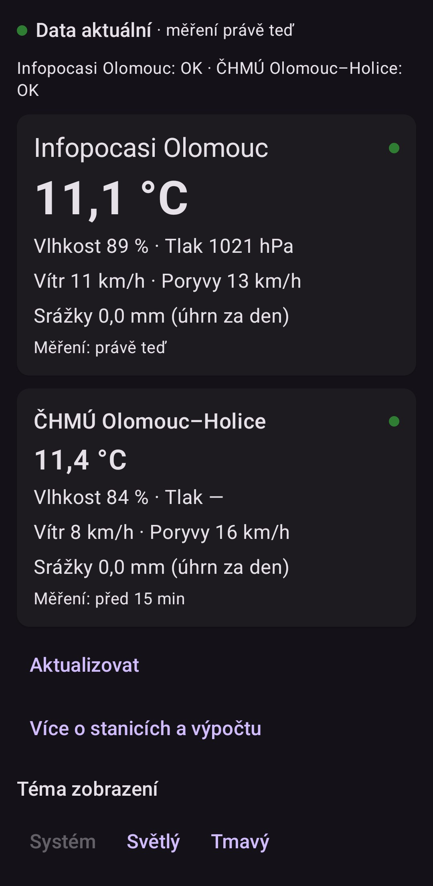

# WSW Olomouc

**Weather Station Widget Olomouc** — an Android app showing the *current weather in Olomouc (Czech Republic) from direct measurements of local weather stations*, not model forecasts.

## Screenshots

| Widget (4×2) | App |
|---|---|
|  |  |

## Data sources

| Source | Type | Update cadence | License |
|---|---|---|---|
| [infopocasi-olomouc.cz](https://infopocasi-olomouc.cz) (Davis station, `customclientraw.txt`) | direct measurement | ~1 min | personal use, used with the operator's consent (2026-09-23) |
| [CHMI Olomouc–Holice](https://opendata.chmi.cz) (open data, station `0-203-0-11742`, measuring since 1850) | direct measurement, 10-min data | file published ~once per hour, occasionally up to ~3 h | CC BY 4.0 |

How the app uses them:

- **Infopocasi is the primary source** (minute-level freshness); **CHMI serves for comparison and as a fallback**.
- The widget **synthesizes both stations** when both are fresh (≤ 30 min): the temperature is a **freshness-weighted average** with weight `1/(age + 15 min)`, shown with a `Ø 2 stations` badge. If the latest CHMI measurement is older than 30 minutes, the widget shows **Infopocasi only**.
- **Precipitation is the daily total** (since local midnight) for both sources.
- **Manual refresh is rate-limited**: at most one request per source per 10 minutes. The limit **persists across app restarts** (it must not be bypassed via the widget refresh button), and a skipped refresh says so honestly: *"Update skipped – manual update available in Y min"*.
- A station measurement is always shown with its **measurement time**; stale data is marked with an orange dot rather than hidden.

## Features

- **App**: both stations side by side with per-source status, feels-like temperature (wind chill / heat index), wind, daily precipitation, transparent data age, manual refresh with honest rate-limit message, dark/light/system theme.
- **Widget 4×2 / 5×2**: synthesized value with source badge, both stations each with its own last-measurement time, 3-hour trend arrow, manual refresh, pure AMOLED black with high-contrast white text.
- **Background sync**: WorkManager every 15 minutes (the minimum WorkManager interval); Android may defer it in Doze overnight — the widget always shows the true data age instead of lying.

## Status

Personal-use project, Phase 1 (M1.x milestones). **Done:** M1.1–M1.8d — including widget v2, UTC filename handling with previous-day fallback for CHMI, persistent rate limiting, UI texts (M1.8a) and the rate-limit persistence fix (M1.8d). **149 unit tests green in CI.** Next: station detail graph with 24 h history (M1.8b) and a landscape station comparison chart (M1.8c). Not on Google Play.

## Tech stack

Kotlin, Jetpack Compose, Glance (widget), OkHttp, Room, DataStore, Hilt, WorkManager. Requires JDK 17 and Android SDK 35.

## Build

```bash
./gradlew assembleDebug       # build
./gradlew testDebugUnitTest   # unit tests
```

CI: GitHub Actions builds the app and runs the full unit-test suite on every push; full build logs are mirrored to the public `ci-logs` branch and a debug APK artifact is attached to every run.

## License

MIT — see [LICENSE](LICENSE). Weather data: CHMI open data under [CC BY 4.0](https://creativecommons.org/licenses/by/4.0/); infopocasi-olomouc.cz data used with the operator's consent, personal use only.
